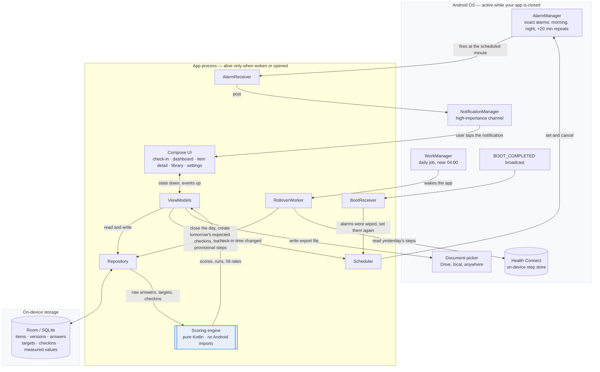

# Habit Accountability App — Architecture

**Status:** approved and in build. §2 platform findings were verified on the device in M0;
§§4–5 record what M1, M2 and M3 actually built.
**Intended repo path:** `docs/architecture.md`
**Companion document:** `docs/product-spec.md`, which is the authority on behaviour. Where this
document and the spec disagree, the spec wins and this document is wrong.

**How to read this.** Every claim is tagged so you know how much to trust it:

- **Decided** — chosen deliberately, with the reasoning stated.
- **Assumed** — a default I picked so the document wasn't full of holes. Push on these.
- **Unverified** — depends on current platform behaviour that must be checked against live
  documentation before it's relied on. My information has a cutoff and this area moves.

---

## 1. What actually decides the stack

Most of the product spec is stack-agnostic. The data model, the scoring rules, the charts and the
question library could be built on almost anything. Four requirements are not agnostic, and they
decide everything:

1. **Notifications that fire at a precise wall-clock time**, twice a day, plus escalation repeats at
   roughly 20-minute intervals, while the app is closed.
2. **Reading step counts from the device's health data.**
3. **A background job near 04:00** that closes the day, generates the next day's expected
   check-ins, and freezes provisional step values.
4. **Rescheduling all of the above after a device reboot.**

Every one of these is Android platform integration, and none of them is business logic. That is
unusual for an app shaped like this one, and it is the whole argument for going native.

### The single most important architectural consequence

**The app is not running most of the time.** The operating system wakes it, it does one small thing,
and the process goes away. There is no long-lived scheduler object, no in-memory state that survives
between a notification firing and the user tapping it, and no guarantee the process that posted a
notification is the process that handles the tap.

This is why expected check-ins are rows in the database rather than entries in a running timer, and
why the rollover job writes to storage rather than holding anything. Any design that assumes a
continuously running app will fail in ways that are hard to reproduce.

---

## 2. Platform findings

Two facts materially shaped the choices below. **Both were tested on the target device in M0** —
Pixel 9 Pro, Android 17, build `CP2A.260805.005`, 4 September 2026. Findings are recorded inline.
**Both came back positive.**

**Exact-time alarms are permission-gated.** `SCHEDULE_EXACT_ALARM` is no longer pre-granted to newly
installed apps targeting Android 13+ and defaults to denied. There is an install-granted
alternative, `USE_EXACT_ALARM`, but Play Store policy reserves it for calendar and alarm-clock apps.
Without exact alarms, an inexact time-windowed alarm can be delayed by the system by ten minutes or
more, which would turn the escalation repeats into approximations.

**Consequence, and it's a favourable one:** because this app is sideloaded to a single personal
device and never submitted for Play review, `USE_EXACT_ALARM` can simply be declared. The policy
restriction is a review matter, not a technical gate. This removes the runtime permission prompt and
the degraded fallback path entirely. If the app were ever published, that decision would have to be
revisited and the fallback built.

> **Verified (M0).** `USE_EXACT_ALARM` was declared and `canScheduleExactAlarms()` returned **true**
> with **no runtime permission prompt ever shown**. A `setExactAndAllowWhileIdle` alarm two minutes
> out fired with a **0 s slip**. The install-granted assumption holds, so **the degraded fallback
> path does not need building.** This was the architecturally decisive half of the question.
>
> **Also verified — deep Doze.** The two-minute smoke test never entered Doze, so it was re-run
> properly: a 15-minute alarm scheduled, the app swiped away, and the device forced into deep idle
> with `dumpsys battery unplug` + `deviceidle force-idle`. `deviceidle get deep` reported **IDLE**
> — so the device genuinely was in Doze, not merely screen-off — and the alarm fired with a
> **0.6 s slip**, battery optimisation unexempted. Comfortably inside the ~1-minute bar a 21:00
> prompt needs. **The core mechanic holds.**
>
> Residual, and not a blocker: this is one forced run. Natural multi-hour Doze also brings
> maintenance windows, thermal throttling and adaptive-battery learning that a 15-minute forced
> window cannot reproduce, so §8 keeps its "observe over several days" mitigation.

**Health Connect can produce steps by itself.** On Android 14+ with SDK extension 20 or higher,
Health Connect is part of the framework rather than a separate install, and once any app holds
`READ_STEPS` it begins capturing steps from the device automatically. This resolves an open worry
from the requirements interview — no third-party fitness app needs to be running. One gotcha: since
the June 2026 update, on-device steps are attributed to a device-specific synthetic package name
rather than the generic `android` package, which matters if step records are ever filtered by source
to avoid double-counting a phone and a watch.

> **Verified (M0), and the prediction was exactly right.** `HealthConnectClient.getSdkStatus`
> returned `SDK_AVAILABLE` with **no separate install** — framework-provided, as expected on
> Android 17. After walking, step records appeared attributed to
> **`com.android.healthconnect.phone.jf9fc11088d6938c28480cb1ae667b25e`** — the device-specific
> synthetic package the June-2026 note describes, not the generic `android` package and not a source
> app. Device reported as Pixel 9 Pro. **On-device step counting works with no sync chain.**
>
> **Worth carrying into §8:** Samsung Health *and* Google Health are both installed on the device.
> Neither produced step records during the test — exactly one origin appeared — but their presence
> means the multi-source double-counting risk is nearer than "a mislaid watch" implies.

A second Health Connect constraint, unrelated to sync: a newly connected app can read only 30 days
of past history. Harmless here, but permanent — there is no route to importing older data later.

**Resolved: the sync worry does not apply.** Whether on-device step counting works was the single
most decision-relevant unknown in this document, and it works. The sync concerns that prompted the
platform review are therefore moot, and **the raw sensor escape hatch in §4 stays unbuilt** — the
step source interface in §5 keeps exactly one implementation, as designed.

---

## 3. Platform choice

**Decided: native Android, Kotlin and Jetpack Compose.**

Three reasons. The four hard requirements are all first-party Android APIs, so there is no bridge
between the app and the thing it needs. Cross-platform capability buys nothing, since this is an
Android-only app for one person on a known device. And as a portfolio artifact it is more
distinctive than another web project, given existing web and QA experience.

### Alternatives considered and rejected

**Expo / React Native.** Faster to move in for a TypeScript developer, and better supported by
coding assistants. Rejected because the cost lands exactly on the four hard requirements: Health
Connect arrives through a community package, the exact-alarm permission handling and boot receiver
need native configuration, and Android background execution is where React Native abstractions leak
most. The realistic failure mode is writing native modules in week three and then maintaining two
languages. **Not rejected on cost** — local Expo builds are free.

**Flutter.** `flutter_local_notifications` is arguably the best-documented cross-platform story for
scheduled and repeating alarms specifically. Rejected because it means learning Dart to buy
cross-platform support that isn't needed.

**Web app or PWA.** Rejected on capability, not preference. It fails three of the four: no Health
Connect access, no way to wake the device at 04:00, and Android web push requires a server
round-trip, so notifications cannot be scheduled locally or fire offline.

### Cost posture

**Decided: zero recurring cost, and nothing to cancel.**

- Android Studio, Kotlin, Compose, Room, WorkManager, AlarmManager: free SDK, no account.
- Health Connect: on-device. No cloud project, no API key, no billing account, no quota. This is a
  real difference from the older Fit REST API.
- **No backend and no Firebase.** Every notification in the spec is a *local alarm* scheduled by the
  app on its own device. There is no push server, no FCM, and no infrastructure to keep running.
  This is a common misconception worth stating explicitly, because notification requirements usually
  imply a server and here they do not.
- Distribution: installed from Android Studio over USB or wireless debugging. The Play Console
  registration fee is a one-time US$25 and is not needed at all
  (https://support.google.com/googleplay/android-developer/answer/6112435). There is also a free
  limited-distribution developer account tier covering up to 20 devices if a cleaner install path is
  ever wanted (https://support.google.com/android-developer-console/answer/16604405) —
  **unverified**, as identity-verification requirements for distribution to certified devices are
  part of a phased rollout.

Non-monetary costs accepted: no auto-updates, so reinstalling is manual; a release keystore that is
free to generate and unrecoverable if lost, so it needs a backup that is not the development laptop;
and a battery-optimisation exemption that is a toggle in device settings.

---

## 4. The stack, item by item

**Toolchain as built (M1, 2026-09-04).** AGP 9.4.0 · Kotlin 2.2.10 · Gradle 9.6.0 · Compose BOM
2026.02.01 · compileSdk/targetSdk 37 · minSdk 34 · Java 11. Package `com.zdredge.consistency`,
versions pinned in `gradle/libs.versions.toml`. Two AGP 9 behaviours to know before editing the
build: it **compiles Kotlin natively** (there is no `org.jetbrains.kotlin.android` plugin to apply),
and Gradle's **configuration cache is on by default**, so any custom task that resolves
configurations at execution time will break it.

### Kotlin — language
**Why:** every modern Android API is designed for it, and the Health Connect client is Kotlin-first
with suspend functions.
**Pro:** no bridge to anything, all first-party docs and samples in one language, null safety
eliminates a bug category.
**Con:** a new language, and coroutines are a genuinely different model from promises.
**Alternative:** Java. Still supported, but coroutine-based APIs would need adapters and Compose
cannot be used from Java at all.

### Jetpack Compose — UI
**Why:** declarative, so the mental model transfers almost directly from React — state in, UI out,
recomposition instead of re-render.
**Pro:** far less code than the XML system; the five screens here are simple.
**Con:** newer, so much of the material online targets the old View system; recomposition has
performance footguns.
**Alternative:** XML layouts with Views. Better documented, substantially more boilerplate, and the
legacy path.

### Room — persistence
**Why:** the data is genuinely relational and the scoring queries are real queries. Room is a thin
type-safe layer over SQLite that validates SQL at compile time.
**Pro:** compile-time SQL checking matters when a wrong join silently produces a wrong score;
migrations are explicit.
**Con:** migrations are hand-written and easy to get wrong; the annotation processor slows builds.
**Alternative:** SQLDelight, where SQL is written first and Kotlin is generated. Also **DataStore**,
which is the right tool for user preferences and the wrong shape for records — expect to use both.

**As built (M3).** Room **2.8.4** with **KSP 2.3.9**, plus the `androidx.room` Gradle plugin to
declare the schema export directory in a form the configuration cache tolerates. KSP's version scheme
decoupled from the Kotlin compiler version at 2.3.0, so the number does not track Kotlin 2.2.10; AGP
9 support landed in 2.3.1 and 2.3.3 moved off the deprecated `compilerOptions` KGP API. `:data`
builds its own database (`createConsistencyDatabase`) so Room stays inside that module — otherwise
`:app` needs Room on its compile classpath and the §5 module boundary becomes a suggestion.

**No `fallbackToDestructiveMigration`.** It is the convenient default and it silently deletes the
user's history when a migration is missing. For an app whose entire value is an undeniable record, a
crash is the better failure.

**Exported schemas are committed** under `data/schemas/`, and every version's identity hash is pinned
by a test.
Room refuses to open a database whose stored hash differs from the compiled one, so the dangerous
change is a schema edited *without the version being bumped*: everything regenerates together, every
test stays green, and the failure lands on a real phone holding real history. M3 verified that by
adding a column and watching all sixty-one instrumented tests pass, which is why the pin exists.

### AlarmManager — check-in notifications and escalation repeats
**Why:** the only API that fires at a precise wall-clock time when the app is not running.
**Pro:** exact, and survives device idle via `setExactAndAllowWhileIdle`.
**Con:** permission-gated, battery-scrutinised, and does not survive a reboot on its own.
**Alternative:** WorkManager with a delay. Simpler, but inexact by design; the system can shift it,
which is unacceptable for a 21:00 accountability prompt.

### WorkManager — the 04:00 rollover job
**Why:** work that must happen reliably but not to the second. Survives reboots, retries on failure.
**Pro:** exactly matches "once a day, near 04:00, don't lose it, retry if it fails".
**Con:** inexact — it may run at 04:07. Nothing user-facing depends on the minute.
**Alternative, and a legitimate one:** do the rollover lazily on next app open. Cheaper and removes
background work entirely. Rejected because provisional step values would never freeze until the app
was opened, and expected-check-in rows would not exist to be missed, which quietly breaks the
primary metric.

### NotificationManager and channels — delivery
**Why:** there is no alternative mechanism. The real decision is channel importance.
**Pro:** a high-importance channel produces heads-up banners and sound.
**Con:** the user can silence a channel in system settings, and the app can neither override that nor
reliably detect it. **This is exactly the muting failure mode the product spec is designed around**,
and it cannot be engineered away — which is why the spec puts confrontation at app-open rather than
relying on notifications escalating.
**Alternative:** a full-screen intent, which is what alarm clocks use. Maximally intrusive,
permission-restricted, and more than the spec asks for.

### BOOT_COMPLETED receiver — rescheduling after restart
**Why:** pending alarms are wiped on reboot. Without this, one restart silently ends all future
notifications, with nothing in the logs and no visible failure.
**Pro:** a few lines that remove an entire class of mystery bug.
**Con:** needs its own permission and may not fire until after first unlock.
**Alternative:** reschedule on every app open. Works until you stop opening the app because it
stopped notifying you.

### Health Connect — steps
**Decided: Health Connect is the sole step source. There is no second implementation and no
fallback path built in advance.**

**Why:** it is the current platform path, Fit is being turned down, and on Android 14+ Health Connect
can count steps from the phone itself, which removes any sync chain for the one metric this app
needs.
**Pro:** on-device, free, no cloud project, no API key, no quota. Unifies any sources added later.
**Con:** parts of the API are still on alpha releases; the permission flow is its own screen;
multiple sources can double-count; and **a newly connected app can only read 30 days of history**,
so there is no deep historical import, ever. The 30-day limit does not affect this app, which starts
from zero and needs 14 days before the dashboard shows anything, but it forecloses ever importing
prior data.

**Alternatives considered and rejected.**

*Raw step-counter sensor via SensorManager.* The genuine technical alternative: reads the hardware
counter directly, so it has no sync chain by definition and nothing on Android is more reliable for
phone-carried steps. Rejected for now because it is a cumulative count since boot that resets on
restart, so daily totals must be reconstructed by hand with reboot gaps handled, and watch data is
permanently unavailable. **Kept as the escape hatch if on-device Health Connect counting turns out
not to work on the device** — but not built in parallel; see the note on the step source interface
in §5.

*Google Health app.* Not an alternative. The Fitbit app was renamed Google Health for existing users
in late May 2026. It is a consumer app, not a developer platform, and Google documents it and Health
Connect as separate products, with Google Health connecting *through* Health Connect like any other
app. The only other route to its data is the Fitbit Web API, which is cloud-based with OAuth, and
the legacy Fitbit Web API shuts down on 30 September 2026. Ruled out.

*Samsung Health via the Samsung Health Data SDK.* A real local SDK, and read access can be used in
developer mode without a partner request, which technically fits a sideloaded personal app.
Rejected on three grounds. It is a mode intended for testing, and any distributed app requires
Samsung partner approval with a registered package name and signing certificate or the SDK refuses
the connection. Samsung's own documentation and developer relations point to Health Connect as the
supported route for reading Samsung Health data. And decisively, **the device is a Pixel**: Samsung
Health on non-Galaxy hardware counts steps from the same phone sensor Health Connect reads, so it
would add an app, an SDK and a vendor dependency to reach identical numbers.

*General note on the sync concern that prompted this review.* Reported Health Connect sync problems
are overwhelmingly problems of the *chain* — a watch syncing late to a vendor app, the vendor app
syncing to a cloud and back, then writing to Health Connect. Routing through Google Health or Samsung
Health lengthens that chain rather than shortening it. The correct response to sync unreliability
here is the shortest possible chain, which is Health Connect counting the phone's own steps with no
source app involved.

### Vico (line charts) and Compose Canvas (calendar heatmap)
**Why:** a heatmap is a grid of coloured rounded rectangles and needs no dependency. Line charts have
real work in axes, scales and touch handling.
**Pro:** minimal dependencies, and full control over the clock-axis problem for bedtime, which no
chart library handles correctly out of the box.
**Con:** Vico's ecosystem is small next to web charting; the Canvas code is yours to maintain.
**Alternative:** MPAndroidChart. Mature, View-based so it needs interop wrapping in Compose, and
barely maintained now.

### Storage Access Framework document picker — export
**Why:** free, no API, no OAuth, and it writes wherever the user points, including Drive.
**Pro:** zero infrastructure.
**Con:** user-initiated only, so there is no automatic scheduled backup.
**Alternative:** Android auto-backup, or app-private storage. Neither gets the data off the device,
which was the point of the requirement.
**Payload — decided:** a single **full-database JSON snapshot**, lossless so item versions, capture
states, edit timestamps, step origins and notes all survive, and re-importable if an import feature
is ever added. A CSV-per-table convenience export is deferred; the in-app table view (spec §5.4)
already covers human inspection.

### A separate pure-Kotlin domain module — scoring engine
**Why:** the scoring rulebook is the part of this app that fails *silently*. A wrong target direction
or a target resolved from the wrong period doesn't crash; it produces a plausible wrong number.
Isolating it makes the entire rulebook testable in fast JVM tests with no emulator.
**Pro:** every rule in spec §3.4, including "silence is not success", becomes a test case rather than
a hope.
**Con:** an extra Gradle module and mapping code between database entities and domain types.
**Alternative:** scoring inside ViewModels. Less code today, and then every rule needs an
instrumented Android test to verify.

**As built (M2).** The rulebook lives in `domain/.../domain/scoring/`, composed of small pure units:
`TargetResolver` and `ContainerSizeResolver` (effective-from, resolved *by date* so a later change
cannot reach backwards), `DirectionEvaluator`, `GoalScorer`, `RunCalculator`, `RollUpCalculator`,
`DerivedMetrics`, `ItemLifecycle`, `Panel`, `GoalCompletion`. Every rule in spec §3.4 is a green JVM
test rather than a hope: **133 tests, no emulator, complete case coverage.** The prediction here held
exactly — the whole rulebook was provable without a device, which is what justified the extra module.

### Manual constructor injection — dependency wiring
**Why:** at five screens, a DI framework is not needed.
**Pro:** no annotation processing, no magic, faster builds, the whole object graph is visible.
**Con:** hand-wiring gets tedious as it grows.
**Alternative:** Hilt, the Android standard. Worth adopting the moment several ViewModels need the
same dependencies. **Assumed:** start manual, switch if the wiring hurts.

---

## 5. Structure

### Modules

| Module | Contains | Depends on |
|---|---|---|
| `:domain` | Scoring, runs, roll-ups, derived metrics, target resolution. Pure Kotlin. | Nothing Android |
| `:data` | Room entities, DAOs, migrations, repository, Health Connect client | `:domain` |
| `:app` | Compose UI, ViewModels, receivers, workers, scheduler, notifications | `:data`, `:domain` |

The rule that matters: **`:domain` has no Android imports.** If it ever needs one, something has
been put in the wrong place.

**As built (M1).** `:domain` is a plain **Kotlin JVM** module (`org.jetbrains.kotlin.jvm`), not an
Android library — and that *is* the enforcement, not a convention: `android.jar` is not on its
classpath, so an Android import cannot compile. Proven by deliberately adding one and watching it
fail. `:data` declares `api(project(":domain"))` rather than `implementation`, so `:app` sees domain
types through it, matching the dependency table above. Source dirs follow each module type:
`src/main/kotlin` in `:domain`, `src/main/java` in the Android modules.

### The step source interface

**Decided.** All Health Connect calls sit behind a single interface in `:data`. This exists for
version pinning — parts of the API are on alpha releases and churn — not as an abstraction over
multiple providers. **There is deliberately only one implementation.** A second implementation
wrapping the raw sensor was considered and rejected as premature; if on-device counting fails, the
interface makes the swap cheap, which is the point of having it at all.

**Origin grouping guard — day one, not deferred.** When reading step records, group by data origin
rather than summing blindly. If more than one origin appears for a single day, do not silently add
them: log it, and surface it in the app. Rationale in the risk table below. This is a few lines of
code, not a reconciliation system; actual multi-source reconciliation waits until a second source
exists.

### Cross-cutting: one clock, one day resolver

**Decided.** The 04:00 day boundary is constraint 1 in the spec appendix, and it is the kind of rule
that gets reimplemented slightly differently in four places. All date arithmetic goes through a
single injected `Clock` and `DayResolver`. Nothing else in the codebase computes which day a
timestamp belongs to. Tests control the clock.

**As built (M1).** The injected clock is **`java.time.Clock`** — JDK-pure so it is fine in
`:domain`, it carries the zone (so `DayResolver` never reads the system zone itself), and
`Clock.fixed(instant, zone)` is exactly the "tests control the clock" this asks for. Production
passes `Clock.systemDefaultZone()`. `DayResolver` lives at
`domain/src/main/kotlin/com/zdredge/consistency/domain/time/DayResolver.kt` and exposes `dayFor`,
`today`, `startOfDay`, `endOfDayExclusive`, `weekStart` and `weekEnd`. `minSdk 34` means `java.time`
is available natively, with no core-library desugaring. Wiring is via `AppContainer` in `:app`.

### Data model

Column lists below are the fields that carry meaning; routine bookkeeping columns are omitted. Every
table also carries `user_id`, unused in v1 (spec constraint 15).

**`items`** — stable identity only. Nothing mutable lives here.
`id` · `kind` (ASKED / MEASURED) · `ordinal` · `created_at` · `retired_at`

`ordinal` was **added in M4 as schema v2**, the first real migration. Nothing in the spec said what
order questions are asked in, and with no ordinal the only stable order was by id — which put "got
out of bed at" before "woke at" in the morning check-in. Order belongs in data rather than in a rule
inferred from the item, so a question created later gets a position without a code change;
`select_options` had worked this way since v1 and items not doing so was an omission. The migration
is an `ALTER TABLE ... ADD COLUMN ... DEFAULT 0`, so an existing install keeps every item.

**`item_versions`** — the mutable definition. Answers reference a *version*, so rewording a question
never retroactively changes what an old answer meant (spec constraint 6).
`id` · `item_id` · `version_no` · `prompt` · `answer_type` (BOOL / NUMBER / TIME / SCALE /
SINGLE_SELECT / MULTI_SELECT) · `classification` (GOAL / OBSERVATION) · `slot` (MORNING / NIGHT /
WEEKLY / NONE) · `unit_label` · `effective_from`

**`select_options`** — **hangs off the item, not the version.** Adding "meditated" to the pre-sleep
list is not a change to the question, so it must not bump the version and re-point every prior
answer at an older definition.
`id` · `item_id` · `label` · `ordinal` · `is_no_opportunity` · `retired_at`

`is_no_opportunity` marks the single option, on goals that have one, that means *no opportunity* —
carried by "took time for yourself" and the three weekly social goals (spec §4). A no-opportunity
answer is an ordinary ANSWERED single-select answer whose selected option carries this flag, so
**no change to the `answers` schema is needed** — which keeps this out of the ask-first guarded
tables. `:domain` checks the flag *before* evaluating direction and returns *excluded* for that
period — neither met nor missed, run unbroken, response rate untouched (spec §3.4, constraint 17,
scoring-cases §10). Keeping it a flag on the option rather than a new answer state is deliberate: it
reuses the select machinery for a behaviour with a handful of known uses, the same posture as the
hardcoded derivation in constraint 13.

**`targets`** — one row per item per period, so an item can hold a daily and a weekly target
simultaneously (spec §3.4).
`id` · `item_id` · `period` (DAY / WEEK) · `direction` (AT_LEAST / AT_MOST / EXACTLY / IS_TRUE /
IS_FALSE / MUST_INCLUDE / MUST_NOT_INCLUDE) · `value_number` · `option_id` · `effective_from`

**`container_sizes`** — `id` · `item_id` · `size_number` · `unit_label` · `effective_from`

**`roll_up_specs`** — **added in M3.** `id` · `item_id` · `source_item_id` · `aggregation`
(COUNT_OF_YES / SUM / AVERAGE / MAX)

This table was missing from the original model and the gap was found while planning M3: `:domain`
already carried a `RollUpSpec` type and spec §3.4 requires roll-ups ("an item may declare a weekly
roll-up naming a source item and an aggregation"), but nothing here stored one. It sits outside the
three ask-first guarded tables, so adding it was in scope; putting it in schema v1 avoided a certain
migration for a requirement already written down.

Only the **recipe** is stored, never the figure — a roll-up total is computed on read like every
other derived value. At v1 `item_id` and `source_item_id` are the same row for all four seeded
roll-ups, because no derived figure has an identity of its own yet: "workouts this week" is a *view*
of `worked_out`, deliberately not an asked item (spec §4 change log). `source_item_id` stays distinct
in the model for when a derived figure does need its own identity, which is an M8 question.

**`checkins`** — a row for every check-in that was *expected*. This is the denominator for response
rate; without this table the primary metric is unmeasurable. Generated at rollover.
`id` · `day_date` · `slot` · `scheduled_at` · `state` (PENDING / ANSWERED / MISSED) ·
`answered_at` · `notify_attempts`

**`answers`**
`id` · `item_id` · `item_version_id` · `day_date` · `submitted_via_checkin_id` ·
`submitted_at` · `capture` (IN_WINDOW / BACKFILLED / LATE / PENDING) · `edited_at` (nullable) ·
`value_bool` · `value_number` · `value_time` · `value_scale` · `note`

**`answer_selections`** — `answer_id` · `option_id`. For the two select types.

**`measured_values`** — `id` · `item_id` · `day_date` · `value_number` · `state`
(PROVISIONAL / FROZEN) · `last_synced_at`

**`measured_origins`** — `measured_value_id` · `origin_package` · `value_number`. This *is* the
origin grouping guard from earlier in this section: more than one row for a day means a second
source appeared.

#### Worked example: Tuesday 25 August 2026

Two check-in rows, spanning two calendar days:

| id | day_date | slot | scheduled_at | state | answered_at |
|---|---|---|---|---|---|
| 812 | 2026-08-25 | NIGHT | 2026-08-25 21:00 | ANSWERED | 2026-08-25 21:14 |
| 813 | 2026-08-26 | MORNING | 2026-08-26 08:00 | ANSWERED | 2026-08-26 08:55 |

Answers, with `day_date` set against `submitted_via_checkin_id`:

| item | day_date | via | capture | value | note |
|---|---|---|---|---|---|
| meals | 2026-08-25 | 812 | IN_WINDOW | 4 | breakfast, lunch, post-ride, dinner |
| vitamins | 2026-08-25 | 812 | IN_WINDOW | true | |
| water | 2026-08-25 | 812 | IN_WINDOW | 2 | |
| workout | 2026-08-25 | 812 | IN_WINDOW | true | a bike ride |
| stretch | 2026-08-25 | 812 | IN_WINDOW | true | |
| coffee | 2026-08-25 | 812 | IN_WINDOW | 2 | |
| mindset | 2026-08-25 | 812 | IN_WINDOW | 4 | |
| took_time | 2026-08-25 | 812 | IN_WINDOW | *(select: yes)* | |
| bedtime | 2026-08-25 | **813** | IN_WINDOW | 23:30 | |
| woke_at | 2026-08-25 | **813** | IN_WINDOW | 08:30 | |
| got_up_at | 2026-08-25 | **813** | IN_WINDOW | 08:52 | |
| pre_sleep | 2026-08-25 | **813** | IN_WINDOW | *(selections)* | watched baseball while reading |

`answer_selections`: `took_time` → `yes`; `pre_sleep` → `read_a_book`, `watched_youtube`. The
`took_time` option list also holds a `no_opportunity` option (flagged `is_no_opportunity` in
`select_options`); it was not chosen here.

`container_sizes`: water, 40, `oz`, effective 2026-08-01. Entering "2" resolves to 80 oz without
storing 80 anywhere, and switching bottles later does not rewrite this row.

`measured_values`: steps, 2026-08-25, 11240, FROZEN, with exactly one `measured_origins` row.

#### Two things the worked example proves

**`day_date` on `answers` is not redundant with the check-in's day.** Four rows above carry
`day_date` = the 25th while arriving via a check-in on the 26th, because of the spec's sleep-day
convention. It looks like denormalisation worth removing; removing it breaks the sleep items and the
"not yet" carry-over at the same time.

**Nothing derived is persisted.** Sleep duration (9h 00m), lingering (22 min), workouts-this-week,
stretches-this-week, coffee-this-week and average mindset are all computed by `:domain` on read. This is the default answer to T4 below: at a
few thousand rows, computing on read is cheap, and cached derived values are a class of bug.

#### How types reach SQLite — decided in M3

Two conversion rules are load-bearing, and both guard the failure this project keeps designing
against: plausible wrong data rather than a crash.

- **Enums persist by name, never by ordinal.** An ordinal means reordering `Direction` or `Capture`
  silently re-labels every historical row — an `AT_LEAST` target quietly becoming `AT_MOST`, with
  nothing to notice. A few bytes per row against an unrecoverable corruption.
- **`LocalDate` and `LocalTime` persist as ISO-8601 text; `Instant` persists as epoch millis.**
  ISO-8601 dates sort lexicographically in the same order they sort chronologically, so a
  `day_date BETWEEN ? AND ?` range query is correct with no conversion inside the WHERE clause and
  the index stays usable. A month boundary is where a sloppier format gives itself away, and
  `AnswerDaoTest` asserts one. Instants are only compared and subtracted, so a number is honest.

`items.created_at` and `select_options.retired_at` are stored as instants but resolved to days
through `DayResolver` in the mapping layer — "was this active in this period" is a day-level question
under the 04:00 boundary, and nothing may compute a day any other way.

#### Challengeable assumptions in this model

- **Typed nullable value columns** rather than a JSON blob or a value-as-text discriminator
  (**T2 — now settled, see §9**). A blob makes the schema tidy and every aggregation query miserable.
- **One answer row per item per day**, keyed on `(item_id, day_date)`. This forecloses ever recording
  the same item twice in one day, which nothing in the spec currently asks for.
- **No event log.** A correction mutates the row and sets `edited_at`. An append-only
  `answer_events` table was considered and rejected as more machinery than a personal app needs,
  accepting that the pre-edit *value* is not recoverable, only the fact that an edit happened.

### Testing posture

`:domain` gets fast JVM unit tests covering the whole §3.4 rulebook — **JUnit 5 (Jupiter)**, chosen
because `@ParameterizedTest` maps directly onto the `docs/scoring-cases.md` tables. Tests use
conventional camelCase identifiers plus `@DisplayName` carrying the doc-faithful text: a backticked
Kotlin test name cannot contain `.` or `:`, so it can neither write `04:00` nor carry a scoring-case
ID like `8.5`, while a display name can. Room migrations and DAO queries get instrumented tests,
which stay on **JUnit 4** as Android requires; the two coexist. **M3 confirmed instrumented over Robolectric** for `:data`: migrations and non-trivial queries are precisely what a re-implemented SQLite would lie about, and Robolectric's API 37 support is beta-only with an SDK sandbox wanting JDK 21 against this project's Java 11. The one exception is the schema version pin, a plain text check over the exported JSON that needs no SQLite and so runs as a fast JVM test. Alarm scheduling and the boot receiver are the hardest things to test
automatically and will mostly be verified by hand on the device — **Assumed**, and if there is a
better approach it is worth finding, since a silently broken scheduler is the worst failure this app
has.

---

## 6. Component communication

Also available as a standalone file at `docs/architecture.mermaid`.

### The four flows worth tracing by hand

**The notification path starts outside the app.** AlarmManager fires, wakes a receiver, the receiver
posts a notification, and the process may die again before the banner is even seen. Tapping it
starts the app fresh. Nothing is held in memory across those steps, which is the concrete reason
expected check-ins live in the database.

**The scoring path is one-directional, deliberately.** The repository hands raw rows to the scoring
engine; the engine hands numbers back. It never reaches into the database, never touches Compose, and
never asks the time except through the injected clock. This is the only part of the diagram where a
mistake produces a wrong answer instead of a crash, which is why it is isolated and why it is the
most heavily tested.

**The rollover job is the only thing that writes without the user.** Once a day it closes the
previous day, generates the next day's expected check-ins, freezes the provisional step count from
two days prior, and re-reads yesterday's. If it never runs, the app looks fine and every number is
subtly wrong. It should be the first thing logged and the first thing checked when something looks
off.

**The Scheduler has two callers**, which is easy to miss: the boot receiver, because alarms do not
survive a restart, and the settings screen, because changing the night check-in time must cancel and
re-set real alarms rather than only updating a stored preference. Nothing else may change when
notifications fire.

---

## 7. Amendments this implies to the product spec

**Both now applied to the spec.** They were consequences of the platform choice rather than changes
of mind.

1. **Export destination — applied.** Spec §2 previously said "local storage plus plain export,
   optionally to Drive". The actual Drive API would require a Google Cloud project and an OAuth consent
   screen for no benefit, so export is the system document picker (`ACTION_CREATE_DOCUMENT`), which
   writes to Drive, local storage or anywhere else the user chooses, with no API and no account. The
   payload is a **full-database JSON snapshot** (see the export entry in §4). Spec §2 now reflects this.
2. **Seed data (spec O7) — applied.** On Android this is not a standalone script but a
   debug-build-only fixture that populates Room directly, triggered from a hidden developer screen or
   an adb broadcast. "Write a seed script" and "write a debug-only database fixture behind a build
   flag" are different tasks. Spec O7 now reflects this and targets ~6 months of history; it is
   scheduled as build-order M9.

---

## 8. Risks

| Risk | Severity | Mitigation |
|---|---|---|
| Battery optimisation delays alarms even with the exact-alarm permission held | **Downgraded High → Medium by M0.** | M0 measured it rather than assuming: in confirmed deep Doze (`deviceidle get deep` = IDLE) with battery optimisation unexempted, an exact alarm fired with a **0.6 s slip**. What one forced 15-minute run cannot show is maintenance windows, thermal throttling and adaptive-battery learning over time — so still watch real firings across the first several days of M6, and request a battery-optimisation exemption during setup as cheap insurance. |
| Rollover job silently fails; all figures quietly wrong | High — invisible | Log every run, record last-successful-rollover, surface staleness in the app rather than only in logs |
| Step double-counting once a second source appears | Medium, and **dormant rather than hypothetical** | M0 confirmed exactly one step origin today (`com.android.healthconnect.phone.jf9fc...`, the on-device synthetic package). But **Samsung Health and Google Health are both already installed** on the device and simply are not writing steps — so a second origin needs no new hardware, just one of them starting to sync. A mislaid Galaxy Watch would add a third. Any of these could appear with no warning from Health Connect, and step counts would quietly inflate. Because the dashboard only shows a 14-day window, this would read as improvement rather than as a bug. Mitigation is the day-one origin grouping guard in §5, not a filtering system. Note also the synthetic-package-name change from June 2026 when identifying origins. |
| Health Connect alpha APIs shift under the build | Medium | Pin versions; isolate all Health Connect calls behind one interface in `:data` |
| Keystore loss | Medium | Off-machine backup before the first release-signed build |
| Kotlin and Compose learning curve stalls momentum | Medium | Build the check-in flow and Room layer first; leave charts until the data exists |
| Publishing later would invalidate the `USE_EXACT_ALARM` decision | Low, unless plans change | Documented in §2; the fallback path would need building |

---

## 9. Open technical questions

| # | Question |
|---|---|
| ~~T1~~ | **Closed by M0.** Health Connect: framework-provided, on-device counting confirmed, origin package observed. Exact alarms: `USE_EXACT_ALARM` install-granted with no prompt, and a 0.6 s slip in confirmed deep Doze — no fallback path needed. Ongoing multi-day observation of real firings lives in §8 as a risk mitigation, not an open question. See §2. |
| ~~T2~~ | **Closed by M3.** Typed nullable columns were kept and the mapping did not get ugly: `EntityMappers.kt` is a flat set of one-line conversions with no branching on answer type, because the domain `Answer` carries the same typed nullable fields the table does. A blob would have added a serialiser on both sides and made every numeric query a parse. Revisit only if a new answer type cannot be expressed as a column. |
| T3 | How to test alarm scheduling and the boot receiver without relying on manual device verification. |
| T4 | Whether the rollover job should also pre-compute and cache dashboard figures, or whether scoring on read is fast enough at a few thousand rows. Probably fast enough; worth measuring rather than assuming. |
| T5 | Compose navigation approach across the five screens — deliberately not decided here. |
